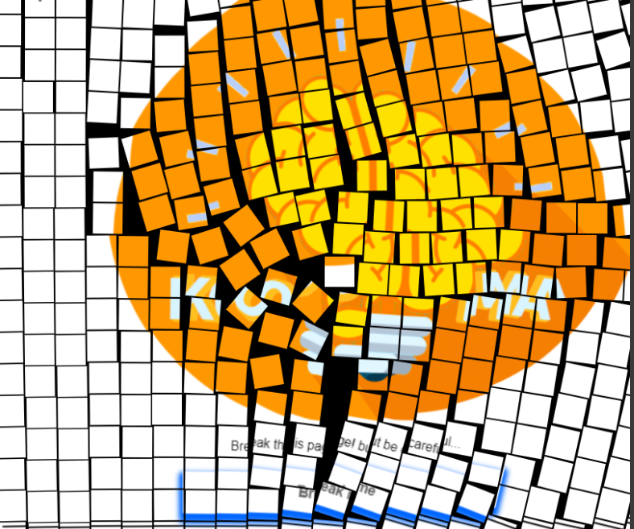

[](https://www.npmjs.com/package/easter-break)
[](https://standardjs.com)


# Easter break
### Ideal package for some easter egg in your site. He just give you ``onClick function`` with canvas destroying current page


<br/>

# Examples


https://user-images.githubusercontent.com/58357980/172224333-ab09a58b-5e78-4b68-90cc-16bdb07318a1.mp4


## Komotedly - NextJS
### Check here (button on the opened left menu): https://komotedly.netlify.app/


## Vue boilerplate


## Codesandbox


### Or check codesandbox - https://codesandbox.io/s/easter-break-y8o6t4?file=/src/App.tsx

# Installation

## Write in terminal of your workspace:

```bash
npm i easter-break
```
or

```bash
yarn add easter-break
```


# Usage

`Note: Button is fully customizable because this package it's just onClick function with Canvas support`

## React
<p align='right'>
 
</p>

```ts
//  EasterBreaker.tsx
import easterBreaker from "easter-break";

 const EasterBraker = () => {
    return (
        <button onClick={easterBreaker}>Break me </button>

    );
  };
  export default EasterBraker
```

``` ts
// App.tsx
import EasterBreaker from './EasterBreaker'

function App() {

  return (
    <div className="App">
        ...
        <EasterBreaker/>
        ...
    </div>
```

Full example - https://github.com/Ivan-Corporation/Easter-break/tree/master/examples/react
<hr/>

## Vue 3
<p align='right'>
 
 </p>

```vue
// EasterBreaker.vue
<template>
   <div class="button" @click="destroy" >
     Break me
   </div>
</template>

<script >
import easterBreaker from 'easter-break'


export default {
  name: 'easter-breaker',
   methods: {
    destroy(){
      easterBreaker();
    }
}
}

</script>
```

``` vue 
// HelloWorld.vue
<template>
  ...
    <button>
      <easter-breaker/>
    </button>
    ...
</template>

<script>
import EasterBreaker from './EasterBreaker.vue'
    ...
</script>
```
Full example - https://github.com/Ivan-Corporation/Easter-break/tree/master/examples/vue
<hr/>


## Native JavaScript


<p align='right'>

</p>

```js
// JS file
import easterBreaker from "easter-break";
document.getElementById("dangerous-button")
        .addEventListener("click", () => easterBreaker());
```


<p align='right'>

</p>

```html
// HTML File

<!DOCTYPE html>
<html>
<head>
    <link rel="stylesheet" href="button.css">
    <script src="index.js"></script>
</head>
<body>
    <button id="dangerous-button"></button>
</body>
</html>
```

## File size:


### If you have CRA 5.0.0 and above and get some garbage in terminal try this script:


> "start": "GENERATE_SOURCEMAP=false react-scripts start",
<hr/>

### If after cliked on button you see:
> You need to enable JavaScript to run this app.
In the left-up corner

Just delete text from your ``index.html`` here:
```html
<noscript>You need to enable JavaScript to run this app.</noscript>
```
`Note: 
it's only for some kind of boilerplate`
